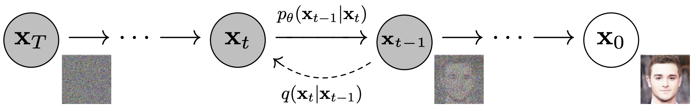
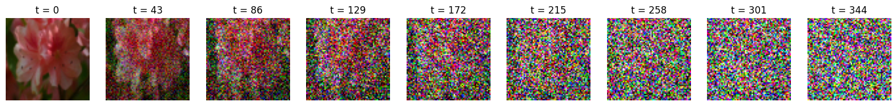
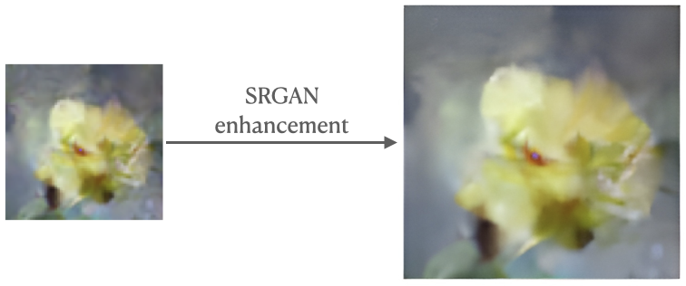
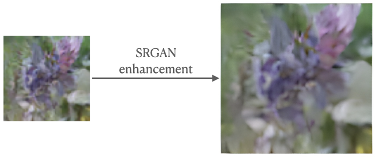

# Simple Diffusion Probabilistic Model from scratch in Pytorch

## What is a Diffusion Probabilistic Model?
The "diffusion model" is a computer model based on Markov chains, that is trained using a technique called variational inference. It is designed to generate samples that are similar to real data after a certain amount of time. The model learns how to undo the effects of a process called diffusion, which involves adding noise to data in a way that slowly distorts it. When the diffusion process involves small amounts of a type of noise called Gaussian noise, the model can be made simpler by using a type of neural network that uses Gaussian distributions [[1]](#references).

    
     
    Source: <a href="#references">[1]</a>

## What does this repository contain?
A quite simple implementation of paper [Denoising Diffusion Probabilistic Models](!https://arxiv.org/pdf/2006.11239.pdf). The code is written in Pytorch and is mainly inspired by [this](!https://www.youtube.com/watch?v=a4Yfz2FxXiY) quick hands-on tutorial. The code is not optimized for speed and is not intended to be used for any serious application. It is just a simple implementation to get a better understanding of the paper. 

I used [Oxford 102 Flower](!https://www.robots.ox.ac.uk/~vgg/data/flowers/102/) dataset containing 102 categories of flowers, each with 40 to 258 images, 8189 images in total (available in `torchvision.datasets`).

    

## Configuration
To work with Diffusion Probabilistic Model, aside from the regular hyperparameters, you need to specify some additional parameters:

- `T`: number of diffusion steps, i.e. the number of times the image is distorted by the diffusion process from the original image to the final image (pure noise). The higher the number of diffusion steps, the more the model will be able to learn the distribution of the data. In the paper, the authors used 1000 diffusion steps. However, I used `T=350` to speed up the training process.

- `Beta schedule`: the diffusion process involves adding noise to the image in a way that slowly distorts it. The amount of noise added at each diffusion step is controlled by a parameter called `beta`. I used a linear beta schedule, i.e. `beta` is linearly increased from `beta_0` to `beta_T` during the diffusion process. I used `beta_0=1e-4` and `beta_T=2e-2` for the linear beta schedule.

- `Image size`: the size of the image used for training. For sake of stability and speed, I used `IMG_SIZE=64` for the training.

- `Batch size`: the number of images used for training at each iteration. I used `BATCH_SIZE=128` for the training.

- `Architecture`: the architecture of the neural network used for training. I used an implementation of U-Net (#references) with ~62M parameters. I used [this](!https://colab.research.google.com/drive/1sjy9odlSSy0RBVgMTgP7s99NXsqglsUL?usp=sharing) U-Net implementation

## Results
The model was trained for 280 epochs on my personal computer which took roughly>22.5 hours! Despite the simple architecture and the small amount of data, and choosing T to be 350 instead of 1000 the model was able to generate images that are similar to the original images in most cases. I used [wandb](!https://wandb.ai/site) to track the training process and the a few results are shown below.

    
    

Because of generating low-quality images, to improve the quality of the outputs, I used [deepai.org API](!https://deepai.org/machine-learning-model/torch-srgan) that uses SRGANs to upscale the generated images to 256x256. The results are shown below.  

## TODO:
I plan to:
- train the model with a more complex architecture and on dataset
- train the model with more diffusion steps

## References
[1]: Ho, J., Jain, A., & Abbeel, P. (2020). Denoising diffusion probabilistic models. Advances in Neural Information Processing Systems, 33, 6840-6851.
